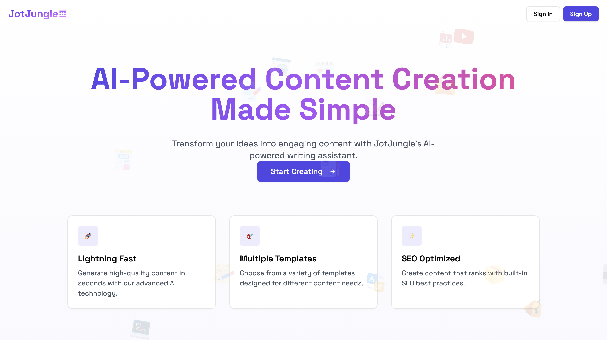

<h1 align="center">
  <span style="background: linear-gradient(to right, #4F46E5, #9B4DFF, #FF9CFF); -webkit-background-clip: text; -webkit-text-fill-color: transparent; font-weight: bold;">
    JotJungle
  </span>
</h1>

<div align="center">


[](https://jotjungle.vercel.app/)
</div>

## 🎯 Overview

JotJungle is a sophisticated AI-powered content generation platform built with modern web technologies. It empowers users to create high-quality content efficiently, from blog posts to technical documentation, leveraging the power of artificial intelligence.

### 🌟 Key Highlights

- **AI-Powered Content Generation**: Utilizes advanced AI models for creating human-like content
- **Multi-Template Support**: Diverse range of content templates for various use cases
- **Real-time Editing**: Rich text editor with markdown support for content refinement
- **Modern UI/UX**: Clean, responsive interface built with Tailwind CSS
- **Secure Authentication**: Enterprise-grade security with Clerk authentication

## ⚡ Core Features

### 🤖 AI Content Generation
- Smart content generation with context awareness
- Multiple content types support
- Customizable generation parameters

### 📝 Template Library
- Blog post generators
- SEO-optimized title creators
- Technical documentation templates
- Social media content generators
- Product description creators
- Code generation and debugging tools

### 🎨 Content Editing Suite
- Rich text editor with Markdown support
- Real-time preview
- Format preservation
- Export options

### 🛡️ Enterprise Features
- Secure authentication
- Role-based access control
- Usage tracking and analytics
- Content history and versioning

## 🛠️ Technology Stack

### Frontend
- **Framework**: Next.js 14 (App Router)
- **Styling**: Tailwind CSS
- **UI Components**: Custom components with shadcn/ui
- **State Management**: React Context API
- **Icons**: Lucide Icons

### Backend & Infrastructure
- **Authentication**: Clerk
- **Database**: NeonDB (Serverless Postgres)
- **ORM**: Drizzle ORM
- **Deployment**: Vercel
- **AI Integration**: Google Generative AI

## 📸 Screenshots

<div align="center">
  <video 
      width="800px" 
      autoplay 
      muted 
      loop 
      playsinline
    >
      <source src="media/JotJungle-dashboard-searching.mp4" type="video/mp4">
      Your browser does not support the video tag.
    </video>
  <p><em>Dashboard - Browse through AI-powered content generation templates with searching capabilities</em></p>
  
  <video 
      width="800px" 
      autoplay 
      muted 
      loop 
      playsinline
    >
      <source src="media/JotJungle-content-generation.mp4" type="video/mp4">
      Your browser does not support the video tag.
    </video>
  <p><em>Content Generation - Create high-quality content with AI assistance</em></p>
  
  <video 
      width="800px" 
      autoplay 
      muted 
      loop 
      playsinline
    >
      <source src="media/JotJungle-rich-text-editor.mp4" type="video/mp4">
      Your browser does not support the video tag.
    </video>
  <p><em>Rich Text Editor - Editing capabilities</em></p>

  <video 
      width="800px" 
      autoplay 
      muted 
      loop 
      playsinline
    >
      <source src="media/JotJungle-history.mp4" type="video/mp4">
      Your browser does not support the video tag.
    </video>
  <p><em>History Page - Track and manage your generated content</em></p>

  
  <p><em>Billing Page - (Feature Coming soon) </em></p>
</div>

## 🚀 Getting Started

### Prerequisites
- Node.js 18+
- npm/yarn/pnpm
- Git

### Quick Start
```bash
# Clone the repository
git clone https://github.com/yourusername/jotjungle.git

# Navigate to project directory
cd jotjungle

# Install dependencies
npm install

# Set up environment variables
cp .env.example .env.local

# Start development server
npm run dev
```

